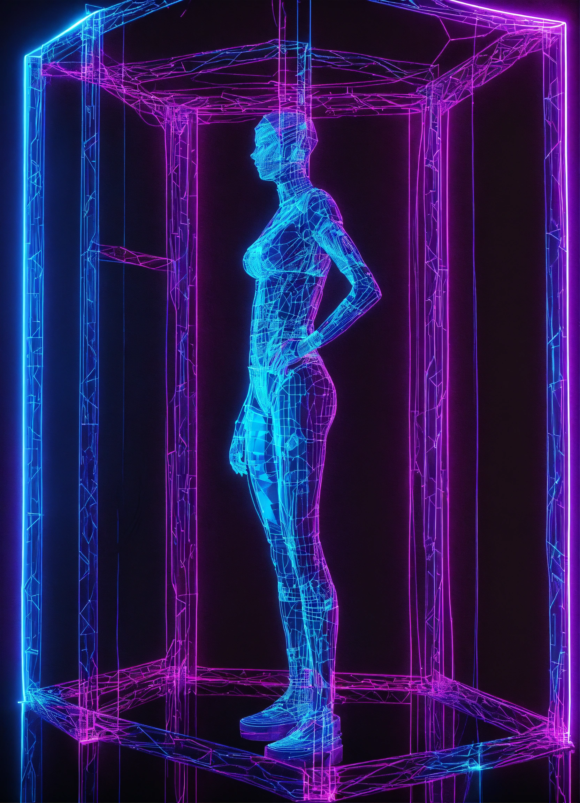

<audio  src="output/podcast.MP3"  controls  title="Podcast editado"></audio>

# Projeto Podcast Gerado por I.A.s em colaboração com a mente humana

Projeto com o objetivo de gerar um podcast utilizando ferramentas de IA através de prompts mais trabalhados e artigo científico publicado.

## 💻 Tecnologias utilizadas no projeto

- [ChatGPT](https://chat.openai.com/)

- [Gemini](http://gemini.google.com)

- [Lexica.ai](https://lexica.art/)

- [ElevenLabs](https://beta.elevenlabs.io/)

## ✨ Como foi feito ?

- Roteiro gerado via chatgpt

- Audio gerado pela elevenLabs

- Lexica.ai Para gerar capas

## 📚 Materiais

- [Link do artigo no Github](https://github.com/DeaMaduS/Criando_Artigos_GPT_Lexica/blob/main/Artigo/Impressão%203D%20Uma%20alternativa%20às%20técnicas%20de%20imobilização%20de%20membros.pdf)

## 🛠️ Instruções de execução

Utilize os prompts dentro do link do `Notion` fornecido na parte de `Materiais` para criar um podcast de maneira automatizada, para isso siga o passo a passo abaixo.

- 🤖 1. Use os prompts de roteiro no `chagpt`

- 🤖 2. Use os prompts de roteiro gerados pelo chatgpt no `ElevenLabs`

- 🤖 3. Use os prompts de artes no `midjourney`

## 👨‍💻 Expert

    
    
&nbsp&nbsp&nbspAndrea Madureira 
    &nbsp&nbsp&nbsp
    <a 
        href="https://github.com/DeaMaduS">
        GitHub
    </a>
    &nbsp;|&nbsp;
    <a 
        href="www.linkedin.com/in/andreamadureira">
        LinkedIn
    </a>
    &nbsp;|&nbsp;
    <a 
        href="https://www.instagram.com/deamadu5/">
        Instagram
    </a>
    &nbsp;|&nbsp;

  

